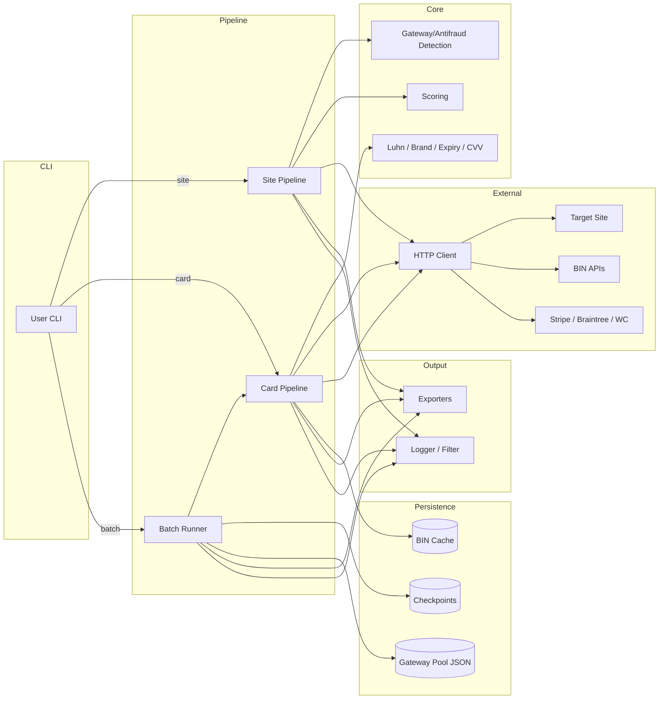
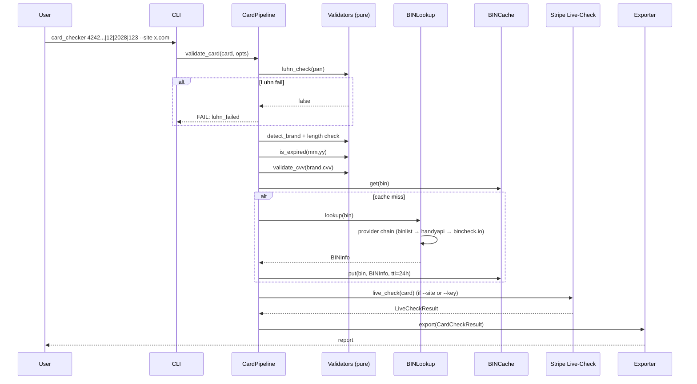
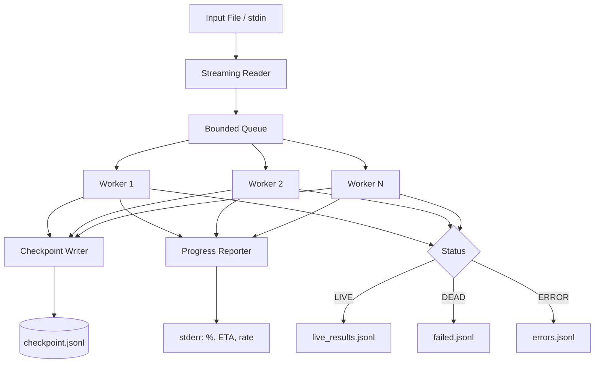
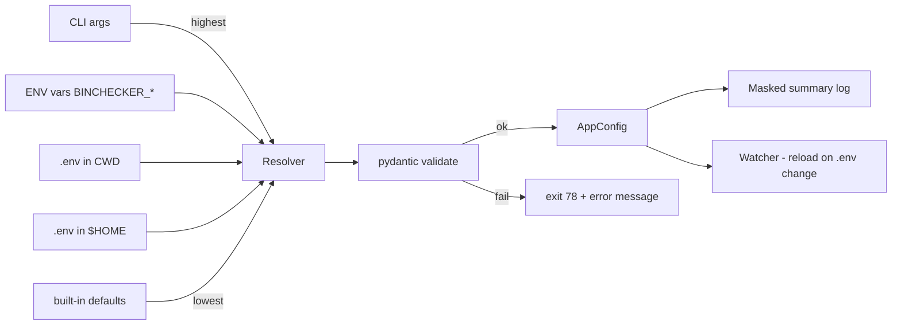

# Design Document: Project Enhancement

## Overview

This document describes the technical design for evolving BIN-Checker from a collection of related Python scripts (`bin_checker.py`, `card_checker.py`, `batch_check.py`, `site_scraper.py`, `sk_web_hunter.py`, etc.) into a cohesive, maintainable, extensible package — `binchecker` — that satisfies the 15 requirements captured in `requirements.md`.

The current code already implements the core domain logic (Luhn, BIN lookup with fallback, gateway signature scanning, Stripe tokenization, WooCommerce checkout flow, gateway pool management). The redesign keeps all that logic but reorganizes it into clean layers, adds the missing capabilities (streaming batch, plugin architecture, structured config, i18n, PCI-safe logging, multiple export formats, checkpoint/resume, three-provider BIN fallback, profile-based config), and grounds the whole system in property-based correctness guarantees.

### Design Goals

1. **Backwards compatibility for users** — every existing CLI entry point (`bin_checker.py <url>`, `card_checker.py <pan>|<mm>|<yy>|<cvv>`, `batch_check.py --file cards.txt`) continues to work; old gateway pool files load unchanged.
2. **Layered separation** — pure logic (Luhn, brand, scoring, parsing) is decoupled from I/O (HTTP, file, cache) so the bulk of the code is property-testable in isolation.
3. **Pluggability** — gateway detectors, card validators, BIN providers, exporters, and live-check backends are all registered through a uniform plugin protocol. Adding a new gateway pattern or BIN provider requires no changes to core code.
4. **PCI-safe by default** — full PANs are never logged; all loggers go through a redaction filter. This is enforced as a property test, not a convention.
5. **Comprehensive observability** — structured logs, rotating files, configurable levels, request IDs that thread through batch operations.

### Design Decisions and Rationale

| Decision | Rationale |
|----------|-----------|
| Single package `binchecker` with sub-modules | Enables `pip install -e .`, plugin entry points, proper test layout. Existing top-level scripts become thin shims. |
| Async-first I/O (`httpx.AsyncClient`) | Required for 1000+ items/hour at concurrency 10–20 (Req. 3.5, 9.3). Existing async code in `sk_web_hunter.py` confirms feasibility. |
| `pydantic` (or `dataclasses + jsonschema`) for config & models | Validates types, ranges, dependencies on startup (Req. 5.5). I lean toward `pydantic-settings` because it composes env-vars, `.env`, and CLI cleanly with a precedence chain. |
| `structlog` + stdlib `logging.handlers.RotatingFileHandler` | Structured JSON logs satisfy Req. 6, and a single redaction filter at the root logger enforces PCI compliance globally. |
| Disk-backed BIN cache (sqlite or `diskcache`) | 24-hour TTL persists across restarts (Req. 2.8); avoids re-hitting rate-limited APIs. |
| `jinja2` for HTML/PDF templates | Custom user templates (Req. 4.5) without code changes; PDF via `weasyprint` from rendered HTML. |
| `babel` + `gettext` (`.po`/`.mo`) for i18n | Industry-standard, supports plural forms and locale-specific number/currency formatting (Req. 14). |
| Plugins via `importlib.metadata` entry points | Auto-discovery on startup (Req. 15.4); compatibility check via declared API version. |
| Checkpoints in JSONL files keyed by content-hash | Cheap, human-readable, supports resume with duplicate detection (Req. 3.7-3.8). |

### What is Out of Scope

- A web UI or HTTP API server — the system remains CLI-first.
- Real-time card monetization (the live-check uses $0 authorizations and decline-code interpretation; the system never actually charges).
- Distributed batch processing across machines — concurrency is in-process.

## Architecture

### Layered Module Map

```
binchecker/
├── core/                  # pure logic, no I/O
│   ├── models.py          # CardData, BINInfo, CheckResult, GatewayMatch, ...
│   ├── pan.py             # mask_pan, normalize_pan, brand-prefix tables
│   ├── luhn.py            # luhn_check, luhn_compute_checksum
│   ├── brand.py           # detect_card_brand, validate_card_length
│   ├── expiry.py          # is_expired, normalize_expiry
│   ├── cvv.py             # validate_cvv
│   └── scoring.py         # site trust score, low-confidence flagging
├── detection/             # gateway / antifraud / 3DS / MCC detection
│   ├── signatures.py      # GatewayPool dataclass + JSON loader
│   ├── gateway.py         # detect_gateways(html, pool) -> list[GatewayMatch]
│   ├── antifraud.py
│   ├── threeds.py
│   ├── mcc.py
│   └── confidence.py      # confidence score per match (Req. 1.5, 1.7)
├── lookup/                # external BIN APIs
│   ├── provider.py        # BINProvider protocol
│   ├── providers/
│   │   ├── binlist.py
│   │   ├── handyapi.py
│   │   └── bincheck_io.py
│   ├── chain.py           # ProviderChain with fallback + backoff
│   └── cache.py           # TTL disk cache
├── live/                  # live-check backends
│   ├── backend.py         # LiveCheckBackend protocol
│   ├── stripe.py
│   ├── braintree.py
│   ├── wc_store_api.py
│   └── interpreter.py     # decline_code → (status, reason)
├── pipeline/              # orchestration
│   ├── card.py            # validate_card(card, opts) -> CardCheckResult
│   └── site.py            # analyse_site(url, opts) -> SiteCheckResult
├── batch/                 # bulk processing
│   ├── runner.py          # AsyncRunner with worker pool
│   ├── reader.py          # streaming line reader (Req. 3.7)
│   ├── checkpoint.py      # JSONL checkpoints (Req. 3.8)
│   ├── progress.py        # tqdm-like progress reporter
│   └── summary.py         # batch report generator
├── export/                # output formats
│   ├── exporter.py        # Exporter protocol
│   ├── json_exporter.py
│   ├── csv_exporter.py
│   ├── html_exporter.py   # jinja2 templates
│   ├── pdf_exporter.py    # weasyprint
│   └── templates/         # default templates per use case
├── config/                # configuration management
│   ├── schema.py          # AppConfig (pydantic)
│   ├── loader.py          # precedence chain (CLI > env > .env(cwd) > .env(home) > defaults)
│   ├── profiles.py        # dev / test / prod
│   ├── watcher.py         # 5-second .env reload (Req. 5.4)
│   └── summary.py         # masked configuration summary log
├── plugins/               # plugin architecture
│   ├── registry.py        # PluginRegistry
│   ├── protocols.py       # GatewayDetectorPlugin, CardValidatorPlugin, ExporterPlugin, BINProviderPlugin
│   └── loader.py          # entry-point discovery + compatibility check
├── http/                  # HTTP infrastructure
│   ├── client.py          # async client factory with TLS-only enforcement
│   ├── retry.py           # exponential backoff + jitter
│   └── ratelimit.py       # 429 handler
├── log/                   # logging
│   ├── setup.py
│   ├── pan_filter.py      # redacts PANs from any log record (Req. 8.1)
│   └── rotation.py
├── i18n/                  # internationalization
│   ├── locale.py
│   ├── currency.py
│   └── messages/          # *.po files (en, ru)
├── cli/                   # command-line interface
│   ├── main.py            # argparse root + subcommands
│   ├── site.py
│   ├── card.py
│   ├── batch.py
│   ├── interactive.py     # REPL mode
│   └── help.py
└── version.py
```

### High-Level Data Flow



### Card Validation Sequence



### Batch Processing Architecture



The reader is a generator — it yields one line at a time and never holds the whole file in memory, so a 100k-card file uses constant memory (Req. 3.7, 9.5).

### Configuration Resolution



## Components and Interfaces

This section describes each component and the contract it presents to the rest of the system. All cross-component interaction goes through Protocol classes (PEP 544) so plugins are first-class citizens.

### `core` — Pure Logic

```python
# core/luhn.py
def luhn_check(pan: str) -> bool: ...
def luhn_compute_check_digit(pan_without_check: str) -> int: ...

# core/brand.py
def detect_card_brand(pan: str) -> CardBrand: ...   # CardBrand is StrEnum
def valid_brand_length(pan: str, brand: CardBrand) -> bool: ...

# core/pan.py
def normalize_pan(raw: str) -> str: ...             # strip non-digits
def mask_pan(pan: str) -> str: ...                  # "411111******1111"
def bin_of(pan: str, length: int = 6) -> str: ...

# core/expiry.py
def normalize_expiry(month: str, year: str, *, today: date | None = None) -> tuple[int, int]: ...
def is_expired(month: int, year: int, *, today: date | None = None) -> bool: ...

# core/cvv.py
def validate_cvv(brand: CardBrand, cvv: str) -> CvvValidation: ...

# core/scoring.py
def compute_site_score(features: SiteFeatures) -> int: ...    # 0..100
def is_low_confidence(score: int, threshold: int = 70) -> bool: ...
```

These functions are deterministic and side-effect free. They form the bulk of the property-tested surface.

### `detection` — Signature-Driven Detection

```python
# detection/signatures.py
@dataclass(frozen=True)
class GatewaySignatures:
    name: str
    patterns: tuple[str, ...]      # case-insensitive substrings
    api_endpoints: tuple[str, ...] = ()
    script_urls: tuple[str, ...] = ()
    weight: int = 10               # contributes to confidence

@dataclass(frozen=True)
class GatewayPool:
    gateways: tuple[GatewaySignatures, ...]
    @classmethod
    def load(cls, path: Path) -> "GatewayPool": ...
    def with_added(self, sig: GatewaySignatures) -> "GatewayPool": ...

# detection/gateway.py
@dataclass(frozen=True)
class GatewayMatch:
    gateway: str
    confidence: int                # 0..100
    matched_signatures: tuple[str, ...]
    evidence_urls: tuple[str, ...]
    low_confidence: bool           # True if confidence < threshold

def detect_gateways(html: str, pool: GatewayPool, *, threshold: int = 70) -> list[GatewayMatch]: ...
```

The pool is loaded from `gateway_pool.json` and merged with plugin contributions on startup. Auto-update (Req. 1.2) is a `binchecker pool update` subcommand that pulls a new JSON from a configured URL — no code changes needed.

### `lookup` — Multi-Provider BIN Resolution

```python
# lookup/provider.py
class BINProvider(Protocol):
    name: str
    async def lookup(self, bin_code: str, client: AsyncClient) -> BINInfo | None: ...

# lookup/chain.py
class ProviderChain:
    def __init__(self, providers: Sequence[BINProvider], cache: BINCache, *,
                 max_retries: int = 3, base_backoff: float = 0.5): ...
    async def lookup(self, bin_code: str) -> BINInfo: ...
```

The chain tries providers in order. On `429`/`5xx` it applies exponential backoff with jitter (`base_backoff * 2**attempt + random()*0.25`) up to `max_retries` per provider, then advances to the next. A successful response is written to the cache with a 24-hour TTL. The cache key is the normalized 6-8 digit BIN; the value includes a fetched-at timestamp so stale entries can be purged.

The default chain bundles three providers (binlist, handyapi, bincheck.io), satisfying Req. 7.5.

### `live` — Live-Check Backends

```python
# live/backend.py
class LiveCheckBackend(Protocol):
    name: str
    async def check(self, card: CardData, ctx: LiveCheckContext) -> LiveCheckResult: ...

# live/interpreter.py
def interpret_decline(code: str, message: str) -> LiveStatus: ...
# returns LIVE / DEAD / UNKNOWN / ERROR with a normalized reason
```

`interpret_decline` is the most decline-code-heavy piece. It is pure — fed a Stripe / Braintree decline code and message, it returns a `(status, normalized_reason)` tuple. This makes the interpretation **fully property-testable** even though the surrounding HTTP is not.

### `pipeline` — Orchestration

```python
# pipeline/card.py
@dataclass(frozen=True)
class CardValidationOptions:
    do_bin_lookup: bool = True
    do_live_check: bool = False
    site_url: str | None = None
    publishable_key: str | None = None
    timeout: float = 5.0

async def validate_card(raw: str, opts: CardValidationOptions, ctx: AppContext) -> CardCheckResult: ...
```

The pipeline implements the strict 7-step sequence specified in Req. 2.7:
`Luhn → brand/length → expiry → CVV format → BIN lookup → live check (optional)`.
A failure at any step fails the whole pipeline and records a precise `failure_step` and `failure_reason`. This is testable as a property: `result.failure_step == first_step_where_predicate_fails(card)`.

### `batch` — Bulk Processing

```python
# batch/runner.py
class BatchRunner:
    def __init__(self, *, concurrency: int = 10, checkpoint: Checkpoint | None = None,
                 progress: Progress | None = None): ...
    async def run(self, lines: AsyncIterator[str], opts: CardValidationOptions) -> BatchSummary: ...

# batch/checkpoint.py
class Checkpoint:
    def is_processed(self, line_hash: str) -> bool: ...
    def mark(self, line_hash: str, result: CardCheckResult) -> None: ...
    def flush(self) -> None: ...
    @classmethod
    def resume(cls, path: Path) -> "Checkpoint": ...
```

The runner enforces concurrency between 1 and 20 (clamped, Req. 3.1). Workers consume from a bounded `asyncio.Queue` of size `concurrency*2`. Failed items are appended to `errors.jsonl` rather than aborting the run (Req. 3.2). When `--resume` is passed, the runner reads the existing checkpoint and skips lines whose content hash is already present (Req. 3.8). Output streams are written line-by-line so memory stays bounded regardless of input size (Req. 9.5).

### `export` — Output Formats

```python
# export/exporter.py
class Exporter(Protocol):
    format_id: str                       # "json" | "csv" | "html" | "pdf"
    extension: str
    async def write(self, results: AsyncIterator[ResultRecord], dst: Path,
                    template: str | None = None) -> ExportSummary: ...

# export/csv_exporter.py
class CsvExporter(Exporter): ...        # RFC 4180-style quoting
# export/json_exporter.py
class JsonExporter(Exporter): ...       # RFC 8259, UTF-8, streaming via ijson-friendly array
# export/html_exporter.py
class HtmlExporter(Exporter):
    def __init__(self, template_dir: Path): ...
# export/pdf_exporter.py
class PdfExporter(Exporter):
    def __init__(self, html: HtmlExporter): ...   # renders HTML → PDF via weasyprint
```

The exporters all consume an async iterator so they stream — even a million-row CSV stays in constant memory.

`ExportSummary` includes `record_count`, `sha256_checksum`, and `schema_version`, satisfying the integrity requirement (Req. 4.8). HTML/PDF generators fail loudly with a clear error when a required template component is missing (Req. 4.3).

### `config` — Configuration Management

```python
# config/schema.py
class AppConfig(BaseSettings):
    model_config = SettingsConfigDict(env_prefix="BINCHECKER_", env_file=".env",
                                      env_file_encoding="utf-8")

    api_timeout: confloat(gt=0, le=120) = 10.0
    log_level: Literal["DEBUG","INFO","WARNING","ERROR"] = "INFO"
    log_dir: Path = Path("./logs")
    cache_dir: Path = Path("./.cache/binchecker")
    bin_cache_ttl_hours: conint(ge=1, le=168) = 24
    concurrency: conint(ge=1, le=20) = 10
    profile: Literal["development","testing","production"] = "production"
    locale: Literal["en","ru"] = "en"
    bin_providers: list[str] = ["binlist","handyapi","bincheck_io"]
    stripe_publishable_key: SecretStr | None = None
    stripe_restricted_key: SecretStr | None = None
    plugin_paths: list[Path] = []

    @field_validator("plugin_paths")
    def _paths_exist(cls, v): ...

# config/loader.py
def load_config(cli_overrides: dict, *, profile: str | None = None) -> AppConfig: ...
```

Precedence is enforced explicitly in `load_config`: it builds the dict by deep-merging defaults → home `.env` → cwd `.env` → env vars → CLI args, then validates. The chosen-source for each field is logged (Req. 5.3, 5.9). On validation failure a clear, multi-line error explains which fields failed and why, and the process exits with code 78 (`EX_CONFIG`) (Req. 5.6).

A profile name selects an additional defaults-overlay (e.g. `development.toml` lowers `log_level` to DEBUG and shortens cache TTL) — applied **before** `.env` so `.env` still wins.

The `Watcher` polls the `.env` file's mtime every second and triggers a hot reload within 5 seconds (Req. 5.4) by re-running `load_config` and atomically swapping `app.config`.

### `plugins` — Plugin Architecture

```python
# plugins/protocols.py
class GatewayDetectorPlugin(Protocol):
    api_version: str = "1"
    name: str
    def signatures(self) -> Iterable[GatewaySignatures]: ...

class CardValidatorPlugin(Protocol):
    api_version: str = "1"
    name: str
    def validate(self, card: CardData) -> ValidationOutcome: ...

class BINProviderPlugin(Protocol):
    api_version: str = "1"
    name: str
    async def lookup(self, bin_code: str, client: AsyncClient) -> BINInfo | None: ...

class ExporterPlugin(Protocol):
    api_version: str = "1"
    format_id: str
    def make_exporter(self, cfg: AppConfig) -> Exporter: ...

# plugins/loader.py
def discover_plugins(group: str = "binchecker.plugins") -> list[LoadedPlugin]: ...
def load_compatible(found: list[LoadedPlugin]) -> Registry: ...
```

Plugins register through Python entry points (`pyproject.toml` `[project.entry-points."binchecker.plugins"]`). On startup the loader filters by `api_version` — incompatible plugins are skipped with a warning, never crash the host (Req. 15.5).

### `http` — HTTP Infrastructure

```python
# http/client.py
def make_client(cfg: AppConfig, *, async_: bool = True) -> httpx.AsyncClient | httpx.Client: ...
# enforces TLS-only (rejects http:// in production), sets sane timeouts, attaches request id

# http/retry.py
async def with_retry[T](fn: Callable[[], Awaitable[T]], *,
                        max_attempts: int = 3, base_backoff: float = 0.5,
                        retry_on: tuple[type[Exception], ...] = (httpx.TimeoutException, httpx.NetworkError)
                        ) -> T: ...
```

The retry helper implements exponential backoff with jitter (Req. 7.2). The 429 handler reads `Retry-After` and respects it.

### `log` — PCI-Safe Logging

```python
# log/pan_filter.py
class PanRedactionFilter(logging.Filter):
    """Redacts any 12-19 digit run that passes Luhn from log records."""
    def filter(self, record: logging.LogRecord) -> bool: ...
```

The filter is attached to the **root logger** — every handler in the system goes through it. The filter scans both `record.msg` and the formatted `record.args`, finds all digit runs of plausible PAN length, and if any of them passes Luhn it is replaced with the masked form (`411111******1111`). The Luhn gate prevents false positives on long random IDs that happen to contain 16 digits.

This turns Req. 8.1 ("never log full card numbers") from a coding convention into a runtime invariant — and into a property test (see Property 9 below).

### `i18n` — Internationalization

```python
# i18n/locale.py
def set_locale(code: str) -> None: ...     # raises UnsupportedLocaleError if missing (Req. 14.1)
def t(key: str, **fmt) -> str: ...         # gettext lookup with fmt substitution

# i18n/currency.py
def format_amount(amount: Decimal, currency: str, locale: str) -> str: ...
```

Translations live as `messages/{en,ru}.po` and are compiled to `.mo` at install time. Missing keys fall back to the message ID (the English source string).

### `cli` — Command-Line Interface

The root command is `binchecker` with subcommands:

```
binchecker site <url>          [--json] [--export <fmt>] [--out <path>]
binchecker card <pan|mm|yy|cvv>  [--site <url>] [--key <pk>] [--no-bin] [--no-live]
binchecker batch                [--file <path>] [--concurrency N] [--resume] [--out-dir <dir>]
binchecker pool                 [list | update | add <signatures.json>]
binchecker config               [show | validate | diff]
binchecker plugins              [list]
binchecker repl                 # interactive mode (Req. 10.3)
```

Existing top-level scripts (`bin_checker.py`, `card_checker.py`, `batch_check.py`) become thin wrappers that re-dispatch to these subcommands, preserving backward compatibility.

The interactive REPL is a small loop on top of `prompt_toolkit` providing tab completion of subcommand names and basic history.

## Data Models

All models are immutable (`@dataclass(frozen=True)` or `pydantic` `model_config = ConfigDict(frozen=True)`) so they can be safely shared across async tasks.

```python
class CardBrand(StrEnum):
    VISA = "VISA"
    MASTERCARD = "MASTERCARD"
    AMEX = "AMEX"
    DISCOVER = "DISCOVER"
    JCB = "JCB"
    DINERS = "DINERS"
    UNIONPAY = "UNIONPAY"
    MAESTRO = "MAESTRO"
    VISA_ELECTRON = "VISA_ELECTRON"
    UNKNOWN = "UNKNOWN"

class CardType(StrEnum):
    DEBIT = "DEBIT"
    CREDIT = "CREDIT"
    PREPAID = "PREPAID"
    UNKNOWN = "UNKNOWN"

class LiveStatus(StrEnum):
    LIVE = "LIVE"
    DEAD = "DEAD"
    UNKNOWN = "UNKNOWN"
    ERROR = "ERROR"
    SKIPPED = "SKIPPED"

class FailureStep(StrEnum):
    LUHN = "luhn"
    BRAND_LENGTH = "brand_length"
    EXPIRY = "expiry"
    CVV = "cvv"
    BIN_LOOKUP = "bin_lookup"
    LIVE_CHECK = "live_check"

@dataclass(frozen=True)
class CardData:
    pan: str                 # only digits
    month: int | None
    year: int | None         # full 4-digit
    cvv: str | None
    raw: str                 # original input

@dataclass(frozen=True)
class BINInfo:
    bin_code: str
    scheme: str = ""
    card_type: CardType = CardType.UNKNOWN
    brand: str = ""
    bank_name: str = ""
    bank_url: str = ""
    country: str = ""
    country_code: str = ""
    prepaid: bool | None = None
    source: str = ""
    fetched_at: datetime | None = None
    error: str = ""

@dataclass(frozen=True)
class LiveCheckResult:
    status: LiveStatus
    backend: str
    decline_reason: str = ""
    auth_code: str = ""
    fingerprint: str = ""
    network_status: str = ""
    risk_score: str = ""
    raw_response_id: str = ""    # opaque pointer to logged raw response
    error: str = ""

@dataclass(frozen=True)
class CardCheckResult:
    card: CardData
    brand: CardBrand
    luhn_valid: bool
    expired: bool
    cvv_valid: bool
    bin_info: BINInfo | None
    live_result: LiveCheckResult | None
    failure_step: FailureStep | None
    failure_reason: str
    duration_ms: int
    timestamp: datetime
    schema_version: str = "1"

@dataclass(frozen=True)
class GatewayMatch:
    gateway: str
    confidence: int
    matched_signatures: tuple[str, ...]
    evidence_urls: tuple[str, ...]
    low_confidence: bool

@dataclass(frozen=True)
class SiteCheckResult:
    url: str
    reachable: bool
    http_status: int
    redirect_chain: tuple[str, ...]
    gateways: tuple[GatewayMatch, ...]
    antifraud: tuple[str, ...]
    threeds: bool
    threeds_markers: tuple[str, ...]
    ssl_issuer: str
    ssl_country: str
    tld: str
    mcc_hints: tuple[str, ...]
    score: int                    # 0..100
    verdict: str
    verdict_detail: str
    duration_ms: int
    timestamp: datetime
    schema_version: str = "1"

@dataclass(frozen=True)
class BatchSummary:
    total: int
    successful: int
    failed: int
    errors_by_type: Mapping[str, int]
    avg_ms_per_item: float
    peak_memory_mb: float
    started_at: datetime
    finished_at: datetime
    output_files: Mapping[str, Path]   # "live" / "failed" / "errors"
```

### Persistence Schemas

* **Gateway Pool** (`gateway_pool.json`): existing schema is preserved as `legacy v0`. A new optional `schema_version` field lets the loader switch parsers — old files keep working (Req. 13.5).
* **Checkpoint** (`checkpoint.jsonl`): one JSON object per processed item with fields `{line_hash, status, result_id, timestamp}`.
* **BIN Cache** (`diskcache` directory): keyed on the normalized BIN; stores serialized `BINInfo` plus `fetched_at`. Entries older than `bin_cache_ttl_hours` are treated as misses on read.


## Correctness Properties

*A property is a characteristic or behavior that should hold true across all valid executions of a system — essentially, a formal statement about what the system should do. Properties serve as the bridge between human-readable specifications and machine-verifiable correctness guarantees.*

The reasoning behind this set is documented in the prework: each acceptance criterion was classified, then logically equivalent properties were merged. The list below is the post-reflection minimum — every property covers at least one criterion that no other property covers, and several properties consolidate related criteria where one statement implies the others.

### Property 1: Luhn correctness

*For any* string of digits `d`, `luhn_check(d)` returns `True` if and only if the Luhn-weighted sum of `d`'s digits is divisible by 10.

**Validates: Requirements 2.1**

### Property 2: Brand detection round-trip

*For any* PAN `p` whose leading digits match exactly one entry in the brand prefix table, `detect_card_brand(p)` returns that entry's brand and `validate_card_length(p)` is `True` whenever `len(p)` lies within the brand's `[min_length, max_length]` interval.

**Validates: Requirements 2.7**

### Property 3: PAN masking exposes only first-6 and last-4

*For any* PAN `p` of length ≥ 10, `mask_pan(p)` returns a string of equal length where the first 6 characters equal `p[:6]`, the last 4 characters equal `p[-4:]`, and every character in between equals `'*'`. For PANs of length < 10, no inner digit is exposed.

**Validates: Requirements 8.1, 8.4**

### Property 4: Pipeline ordered short-circuit

*For any* `CardData` `c`, `validate_card(c, opts)` returns a result whose `failure_step` equals the first step in the canonical sequence (`LUHN → BRAND_LENGTH → EXPIRY → CVV → BIN_LOOKUP → LIVE_CHECK`) whose predicate evaluates to false on `c`, and no step after that point is invoked. If all enabled steps pass, `failure_step` is `None`.

**Validates: Requirements 2.1, 2.4, 2.7**

### Property 5: Provider chain fallback

*For any* sequence of provider success/failure outcomes `O = (o_1, ..., o_n)` where `n ≥ 2`, `ProviderChain.lookup(bin)` returns the `BINInfo` from the first `o_i` that is a success, or — if every `o_i` is a failure — raises `BINLookupError` listing every provider's failure. Providers after the first success are not invoked.

**Validates: Requirements 2.2, 7.1**

### Property 6: BIN cache honours TTL

*For any* cache entry `(bin, info, fetched_at)` and any "now" timestamp, `cache.get(bin, now)` returns `info` if and only if `now − fetched_at < ttl`, and the underlying provider chain is invoked exactly when the cache returns a miss.

**Validates: Requirements 2.8, 7.3, 7.4**

### Property 7: Exponential backoff bounds

*For any* sequence of `n` consecutive failed retry attempts with base delay `b` and jitter factor `j ∈ [0, 0.25]`, the delay between attempt `i` and attempt `i+1` lies in the closed interval `[b · 2^i, b · 2^i · (1 + j)]` for every `i ∈ [0, n−1]`.

**Validates: Requirements 7.2**

### Property 8: Decline interpretation determinism

*For any* known decline code `c` defined in the interpreter's table, `interpret_decline(c, msg)` returns the same `(LiveStatus, normalized_reason)` pair on every call regardless of `msg` content. *For any* unknown code `c'`, `interpret_decline(c', msg)` returns `(LiveStatus.ERROR, c')` with the original code preserved as the reason.

**Validates: Requirements 2.9**

### Property 9: PAN redaction filter is universal

*For any* `logging.LogRecord` whose formatted message contains zero or more digit runs of length 12–19, after passing through `PanRedactionFilter` the formatted output contains no digit run of length 12–19 that satisfies the Luhn check. Strings of digits that do not pass Luhn are left untouched (preserving e.g. random IDs and timestamps).

**Validates: Requirements 8.1, 8.4**

### Property 10: HTTPS enforcement in production profile

*For any* URL `u`, the production HTTP client constructed via `make_client(cfg_with_profile=production)` raises `InsecureUrlError` when `u.scheme == "http"` and accepts `u` when `u.scheme == "https"`. In `development` profile both schemes are accepted (with a warning logged for `http`).

**Validates: Requirements 8.5**

### Property 11: Gateway match confidence and low-confidence flag

*For any* `GatewayMatch` produced by `detect_gateways(html, pool, threshold=t)`: `0 ≤ confidence ≤ 100`; `matched_signatures` is non-empty; and `low_confidence == (confidence < t)`.

**Validates: Requirements 1.5, 1.7**

### Property 12: Plugin pool merge

*For any* set of `GatewayDetectorPlugin` instances `P = {p_1, ..., p_k}`, the effective pool used by `detect_gateways` equals the union of the base pool's signatures and `⋃_i p_i.signatures()`. For any HTML containing a signature contributed exclusively by `p_j`, `detect_gateways` returns a `GatewayMatch` whose `gateway` field equals the gateway named by `p_j`.

**Validates: Requirements 15.1, 15.4**

### Property 13: Plugin compatibility filter

*For any* set of plugins discovered at startup, each carrying an arbitrary `api_version` string, the registry after `load_compatible(...)` contains exactly those plugins whose `api_version == "1"`. Startup completes without exception regardless of how many plugins are incompatible; an INFO-level log line records each skipped plugin.

**Validates: Requirements 15.5**

### Property 14: Concurrency is clamped to [1, 20]

*For any* user-supplied concurrency value `n` (any integer), `BatchRunner` runs with effective concurrency `clamp(n, 1, 20)`.

**Validates: Requirements 3.1, 9.3**

### Property 15: Batch result partition

*For any* batch run over `N` input lines, the produced output streams `(success, failed, errors)` are pairwise disjoint, `len(success) + len(failed) + len(errors) == N`, and the union of the three streams is a permutation of the per-line results. The summary's `errors_by_type` counts sum to `len(errors) + len(failed)`.

**Validates: Requirements 3.2, 3.4, 3.9**

### Property 16: Checkpoint resume avoids duplicates

*For any* input list `L` and any subset `C ⊆ L` already recorded in the checkpoint, a resumed run processes exactly `L \ C` and the final output stream contains every element of `L` exactly once.

**Validates: Requirements 3.8**

### Property 17: Streaming keeps memory bounded

*For any* input stream of size `N` and any concurrency `c`, the peak resident memory consumed by the batch runner is bounded above by a function `f(c)` independent of `N` (i.e. doubling `N` does not increase peak memory beyond a constant factor of `f(c)`).

**Validates: Requirements 3.7, 9.5**

### Property 18: Progress counters are monotonic

*For any* progress event stream emitted by `Progress`, the `processed` counter is monotonically non-decreasing, `remaining == total − processed` at every observed moment, and `eta` is non-negative whenever `rate > 0`.

**Validates: Requirements 3.3, 10.4**

### Property 19: JSON export round trip preserves all data

*For any* `CardCheckResult` or `SiteCheckResult` `r`, `json.loads(JsonExporter.write([r]))` yields a structure that, when re-hydrated through the corresponding `from_dict`, produces a result equal to `r` field-by-field. The output always includes `schema_version` and the package `version`.

**Validates: Requirements 4.1, 4.4, 4.8, 13.3**

### Property 20: CSV export round trip is robust to special characters

*For any* list of records `R` whose field values may contain commas, double quotes, newlines, or non-ASCII characters, `CsvExporter.read(CsvExporter.write(R)) == R`.

**Validates: Requirements 4.2**

### Property 21: Export integrity reporting is honest

*For any* export operation producing output bytes `B` from records `R`, the returned `ExportSummary` satisfies `record_count == len(R)` and `checksum == sha256(B).hexdigest()`.

**Validates: Requirements 4.8**

### Property 22: Unknown export format raises ExportError

*For any* string `f` not equal to any registered exporter's `format_id`, `get_exporter(f)` raises `ExportError` whose message includes the full list of supported `format_id` values.

**Validates: Requirements 4.6**

### Property 23: Template validation precedes render

*For any* template body that fails the validator (syntax error, missing required block, undeclared variable in strict mode), `HtmlExporter.write(..., template=t)` raises `TemplateValidationError` before any record is rendered.

**Validates: Requirements 4.5, 4.7**

### Property 24: Configuration precedence

*For any* configuration field `f` and any combination of values supplied by the sources `(CLI, env, .env_cwd, .env_home, profile_defaults, builtin_defaults)`, `load_config(...)` resolves `f` to the value supplied by the highest-precedence source that supplied any value, where precedence is `CLI > env > .env_cwd > .env_home > profile_defaults > builtin_defaults`. The corresponding `resolution_log[f]` equals the name of that source.

**Validates: Requirements 5.1, 5.2, 5.3, 5.7, 5.8**

### Property 25: Configuration validation rejects invalid input

*For any* `AppConfig` field assigned a value outside its declared type or range, `load_config(...)` raises a structured error whose message names every offending field with its declared constraints, and the surrounding CLI exits with code `78`.

**Validates: Requirements 5.5, 5.6**

### Property 26: Masked summary never leaks secrets

*For any* `AppConfig` containing one or more `SecretStr` fields with non-empty values, the string emitted by `config.summary.render(cfg)` contains the masked form (e.g. `"***"` or `"sk_li***...***"`) for every secret and contains no verbatim secret substring.

**Validates: Requirements 5.9, 8.1**

### Property 27: Legacy gateway-pool config loads identically

*For any* legacy v0 `gateway_pool.json` file, `GatewayPool.load(path)` returns a pool whose set of `(gateway_name, signatures)` pairs equals the set produced by loading the same file converted to v1 schema.

**Validates: Requirements 13.5**

### Property 28: Locale switch is deterministic and total

*For any* locale string `code`, `set_locale(code)` succeeds iff `code` is in the registered locales (`en`, `ru` plus any plugin-installed locales) and raises `UnsupportedLocaleError` otherwise. After a successful switch, `format_amount`, `format_date`, and `t(...)` all derive their output from the active locale's rules: thousands/decimal separators, date order, and currency symbol.

**Validates: Requirements 14.1, 14.3, 14.5**

### Property 29: Unicode round-trips through I/O

*For any* unicode string `s`, both `json_load(json_write(s)) == s` and `csv_read(csv_write([{"v": s}]))[0]["v"] == s` hold for every codepoint in the BMP and supplementary planes.

**Validates: Requirements 14.4**

### Property 30: Log level filter

*For any* configured level `L_cfg` and any record level `L_rec`, the redaction-filtered log handler emits the record iff `L_rec ≥ L_cfg`.

**Validates: Requirements 6.5**

### Property 31: Rotation cap

*For any* synthetic write loop driving the rotating handler, the number of retained log files at any moment is at most `backupCount + 1` (the active file plus archived).

**Validates: Requirements 6.4**

## Error Handling

Errors are modelled as a small, well-typed hierarchy so that callers (CLI, plugins, batch workers) can branch on category without parsing strings.

```
BinCheckerError                       (root, abstract)
├── ConfigError
│   ├── ConfigValidationError         exit code 78
│   └── ConfigSourceError             exit code 78
├── NetworkError
│   ├── ProviderError                 (transient — retried)
│   └── InsecureUrlError              (fatal in production)
├── ValidationError
│   ├── LuhnError, BrandError, ExpiryError, CvvError
│   └── BatchInputFormatError
├── LookupError
│   └── BINLookupError                (all providers exhausted)
├── LiveCheckError
│   ├── BackendError
│   └── DeclineError                  (DEAD/UNKNOWN — not raised, encoded in result)
├── ExportError
│   ├── UnsupportedFormatError
│   ├── TemplateValidationError
│   └── IntegrityError
└── PluginError
    ├── PluginCompatibilityError      (warned, not raised)
    └── PluginLoadError
```

### Strategy by Layer

| Layer | Failure mode | Handling |
|-------|--------------|----------|
| Pure core | Should never raise; functions return tagged results (`Optional`, `Result`-like dataclass) | Property tests enforce totality |
| Detection | Bad signature data → `PluginCompatibilityError` (logged, plugin skipped) | Never aborts the run |
| HTTP | Timeout / 5xx / network → `ProviderError` retried with backoff | After max retries, surfaces to caller |
| Provider chain | Every provider failed → `BINLookupError` | Card pipeline records BIN step failure, continues if `--no-fail-on-bin` |
| Live check | Network/backend error → `LiveCheckError` (caught, encoded as `LiveStatus.ERROR`) | Pipeline returns full result with `live_result.status = ERROR` |
| Pipeline | First failing step recorded; later steps skipped | Property 4 |
| Batch worker | Any non-fatal exception → captured in `errors.jsonl` | Runner continues |
| Batch runner | OS-level fatal (memory, disk full) → graceful shutdown, checkpoint flushed | Resume-friendly |
| Config loader | Any validation error → exit code 78 with multi-line message | Property 25 |
| Logging | Filter is fail-closed: if redaction itself fails, the record is replaced with `"<redacted>"` rather than emitted raw | Defense-in-depth for Property 9 |

### Exit Codes

| Code | Meaning |
|------|---------|
| 0 | Success |
| 1 | Generic failure (uncaught) |
| 2 | CLI usage error |
| 64 | Batch had partial failures (configurable) |
| 65 | Input data error (malformed batch file) |
| 66 | I/O error (cannot read input / write output) |
| 69 | Service unavailable (all BIN providers exhausted, live-check backend unreachable) |
| 78 | Configuration error |

### Logging Contract on Error

Every error log record carries the following structured fields: `event`, `error_type`, `error_message`, `request_id`, `correlation_id`, `url` (where applicable), `http_status` (where applicable), `duration_ms`, `traceback_id`. Tracebacks are stored separately in `tracebacks/{traceback_id}.txt` so that the main log file remains compact and PCI-clean (no PANs leak through `repr` of card objects).

## Testing Strategy

The suite is organised in three layers, each with a clear cost/value trade-off.

### Layer 1: Property-Based Tests (PBT)

PBT applies to this feature because the bulk of the system is pure logic: Luhn, brand detection, expiry/CVV validation, PAN masking, scoring, gateway signature matching, decline-code interpretation, config precedence resolution, JSON/CSV serialization, checkpoint resume, redaction filter, provider-chain selection, and locale formatting. Each of these has well-defined "for all inputs" invariants.

**Library**: [`Hypothesis`](https://hypothesis.readthedocs.io/) — the de-facto Python PBT library.

**Configuration**:
- Each property test runs with `@settings(max_examples=200, deadline=None)` (≥100 iterations, deadline disabled because some properties involve mocked network).
- Stateful tests (cache TTL, batch resume, progress monotonicity) use `RuleBasedStateMachine`.
- Each test carries a tag comment matching the design property:
  ```python
  # Feature: project-enhancement, Property 4: Pipeline ordered short-circuit
  ```
- A pytest collector (`pytest_collection_modifyitems`) verifies that every `Property N` from the design has at least one test bearing the matching tag — a missing property fails CI.

**Generators (custom strategies)**:
- `valid_pan_strategy()` — emits Luhn-valid PANs across all known brand prefixes, varying length.
- `invalid_pan_strategy()` — emits PANs that fail at exactly one named step (Luhn / brand / expiry / cvv).
- `card_strategy()` — composes PAN, expiry, CVV with realistic distributions.
- `bin_response_strategy()` — emits provider-shaped JSON for all three providers, including failure responses.
- `html_with_signatures_strategy(pool)` — emits HTML containing random subsets of pool signatures.
- `unicode_text_strategy()` — full BMP + supplementary planes for round-trip tests.
- `config_dict_strategy()` — emits valid AppConfig dicts and adversarial invalid ones.

**External effects**: PBT runs against mocks, never real APIs. The `httpx.MockTransport` is used to inject deterministic provider responses; Hypothesis fuzzes the response patterns.

### Layer 2: Example-Based Unit Tests

Used for things that are not naturally universal:
- CLI `--help` snapshot tests for every subcommand (Req. 10.1, 10.3).
- Default gateway pool contains the 20 named gateways (Req. 1.4).
- Default provider chain contains ≥3 providers (Req. 7.5).
- Locale files exist for `en` and `ru` (Req. 14.2).
- Plugin example loads (Req. 15.3).
- Decline-code interpreter handles the documented Stripe / Braintree code list.

### Layer 3: Integration Tests

Reserved for things that PBT cannot answer cheaply:
- 1000-site gateway-detection corpus, asserting ≥95% accuracy (Req. 1.1).
- 500 valid + 500 invalid card corpus for end-to-end pipeline accuracy (Req. 2.5, 2.6).
- Throughput benchmark: process 1000 cards through a mocked Stripe backend at concurrency 10 in under one hour (Req. 3.5).
- Latency benchmarks: `analyse_site` p95 ≤ 10 s on a representative URL list (Req. 9.1); `validate_card` p95 ≤ 5 s (Req. 9.2).
- Memory benchmark: `tracemalloc` peak ≤ 100 MB on a typical 100-card run and ≤ 100 MB × constant on a 100k-card stream (Req. 9.4).
- Real-API smoke (gated by an `INTEGRATION_REAL=1` env var): one query against each live BIN provider to detect upstream schema drift.
- `.env` hot reload (Req. 5.4).
- Quarterly accuracy suite (Req. 1.6) — runnable as `pytest -m quarterly`.

### Layer 4: Smoke / Compliance Checks

- `pyproject.toml` declares all dependencies (Req. 13.1).
- `CHANGELOG.md` and migration notes exist (Req. 13.2).
- `README.md` covers all subcommands and config keys (Req. 12.1, 12.4).
- Coverage gate: critical packages (`core/`, `pipeline/`, `lookup/chain.py`, `log/pan_filter.py`, `config/loader.py`) ≥ 80 %, enforced by `pytest --cov` (Req. 11.5).
- A "no-PAN-in-logs" CI step replays a recorded test log against `PanRedactionFilter` and greps for any Luhn-valid PAN — a complementary smoke test for Property 9.

### Test Organization

```
tests/
├── property/
│   ├── test_luhn.py
│   ├── test_brand.py
│   ├── test_pan_mask.py
│   ├── test_pipeline_order.py
│   ├── test_provider_chain.py
│   ├── test_bin_cache.py
│   ├── test_backoff.py
│   ├── test_decline_interpreter.py
│   ├── test_pan_redaction.py
│   ├── test_https_enforcement.py
│   ├── test_gateway_match.py
│   ├── test_plugin_merge.py
│   ├── test_plugin_compat.py
│   ├── test_concurrency_clamp.py
│   ├── test_batch_partition.py
│   ├── test_checkpoint_resume.py
│   ├── test_streaming_memory.py
│   ├── test_progress_monotonic.py
│   ├── test_json_roundtrip.py
│   ├── test_csv_roundtrip.py
│   ├── test_export_integrity.py
│   ├── test_export_unknown.py
│   ├── test_template_validation.py
│   ├── test_config_precedence.py
│   ├── test_config_validation.py
│   ├── test_masked_summary.py
│   ├── test_legacy_pool.py
│   ├── test_locale_switch.py
│   ├── test_unicode_roundtrip.py
│   ├── test_log_level_filter.py
│   └── test_rotation_cap.py
├── unit/
│   ├── test_cli_help.py
│   ├── test_default_pool.py
│   ├── test_default_chain.py
│   └── test_locales_present.py
├── integration/
│   ├── test_gateway_corpus.py
│   ├── test_card_corpus.py
│   ├── test_throughput.py
│   ├── test_latency.py
│   ├── test_memory.py
│   ├── test_dotenv_reload.py
│   └── test_provider_smoke.py     # gated by INTEGRATION_REAL=1
├── compliance/
│   ├── test_no_pan_in_logs.py
│   ├── test_coverage_gate.py
│   └── test_changelog_present.py
└── fixtures/
    ├── gateway_corpus/             # 1000 labeled HTML samples
    ├── valid_cards.txt             # 500 known-valid (test cards)
    ├── invalid_cards.txt           # 500 known-invalid
    └── legacy_pool_v0.json
```

### Continuous Integration

CI pipeline:
1. Lint (`ruff`), type-check (`mypy --strict` on `core/`, `pipeline/`, `config/`).
2. Property + unit suite (`pytest tests/property tests/unit`).
3. Compliance suite.
4. Integration tests (excluding `INTEGRATION_REAL`).
5. Coverage gate.
6. Build artefacts (`hatch build`) and publish to internal index.

This gives us strong correctness guarantees from the property layer, a small, focused unit layer for static facts, and integration layers that exercise real-world performance and accuracy budgets — all while keeping the day-to-day inner loop fast.
