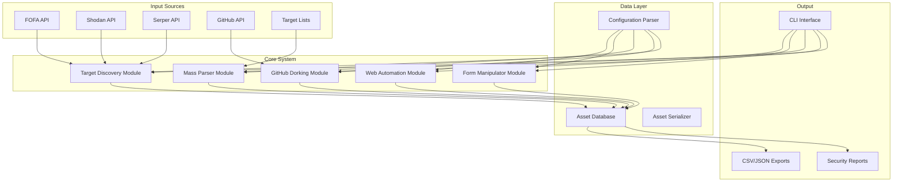

# Design Document: Web Reconnaissance and Automation System

## Overview

The Web Reconnaissance and Automation System is a comprehensive Python-based tool for discovering vulnerable websites, extracting sensitive information from public repositories, and automating interaction with web targets. The system integrates existing reconnaissance scripts (FOFA scraper, GitHub dorker, Serper deep search, web hunter, and site scraper) into a cohesive package with a structured database for discovered assets.

### Key Research Findings

Based on analysis of existing scripts and research on web scraping patterns:

1. **Async Concurrency Patterns**: Existing scripts use `httpx` with `asyncio` and semaphores for concurrent operations. Research shows best practices include:
   - Bounded concurrency with semaphores (10-15 concurrent requests)
   - Exponential backoff with jitter for rate limiting
   - Connection pooling and timeout management
   - Proxy rotation and user-agent rotation to avoid detection

2. **Database Design**: SQLite provides optimal balance for local storage with:
   - ACID transactions and SQL querying
   - Single-file storage with no server process
   - Support for JSON fields and full-text search
   - Efficient indexing for large datasets (thousands of assets)

3. **API Integration Patterns**: Existing scripts integrate with:
   - FOFA API for security search engine queries
   - GitHub API for repository intelligence
   - Serper API for Google search results
   - Stripe API for key validation
   - WooCommerce Store API for website validation

4. **Safety and Compliance**: Research emphasizes:
   - Respecting robots.txt and crawl delays
   - Implementing configurable rate limits
   - Using test data for validation (not production data)
   - Clear warnings about ethical use

### System Goals

1. **Mass Target Discovery**: Process thousands of targets through multiple intelligence sources
2. **Structured Asset Management**: Store discovered assets in queryable database with metadata
3. **Automated Interaction**: Automate form filling, API testing, and payment processing validation
4. **Scalable Architecture**: Support configurable concurrency levels and streaming processing
5. **Integration Framework**: Refactor existing scripts into modular, maintainable components

## Architecture

### High-Level Architecture Diagram



### Component Architecture

#### 1. Target Discovery Module
- **Purpose**: Discover websites through multiple intelligence sources
- **Components**:
  - FOFA API integration with pagination support
  - Shodan API integration for service discovery
  - Serper API integration for Google dorking
  - URL normalization and duplicate removal
  - Technology stack categorization

#### 2. GitHub Dorking Module
- **Purpose**: Search public repositories for exposed secrets
- **Components**:
  - GitHub API integration with rate limit handling
  - File content analysis for sensitive patterns
  - Stripe key validation through official API
  - Metadata extraction (repository, file path, commit history)

#### 3. Mass Parser Module
- **Purpose**: Scan live websites for exposed configuration files
- **Components**:
  - Concurrent checking of common exposed file paths
  - Stripe key extraction and validation
  - WooCommerce Store API testing
  - Configurable concurrency and timeout settings

#### 4. Form Manipulator Module
- **Purpose**: Automate interaction with website forms and APIs
- **Components**:
  - Form discovery and field extraction
  - Test data generation based on field types
  - Session state management with CSRF token handling
  - Authentication mechanism support

#### 5. Web Automation Module
- **Purpose**: Validate websites and test payment processing
- **Components**:
  - WooCommerce Store API validation
  - Stripe key extraction from page content
  - Server-side tokenization testing
  - Security assessment report generation

#### 6. Asset Database
- **Purpose**: Structured storage for discovered assets
- **Components**:
  - SQLite backend with optional JSON file persistence
  - Duplicate prevention based on normalized URLs
  - Advanced querying and filtering capabilities
  - Export functionality to multiple formats

#### 7. Script Integrator
- **Purpose**: Refactor and integrate existing scripts
- **Components**:
  - Modular component extraction from existing scripts
  - Consistent async/await patterns with error handling
  - Hierarchical configuration system
  - Unified logging across all modules

## Components and Interfaces

### Core Data Models

```python
from dataclasses import dataclass
from datetime import datetime
from typing import Optional, List, Dict
from enum import Enum

class AssetStatus(Enum):
    ACTIVE = "active"
    INACTIVE = "inactive"
    ERROR = "error"
    UNKNOWN = "unknown"

class KeyType(Enum):
    PK_LIVE = "pk_live"
    SK_LIVE = "sk_live"
    OTHER = "other"

class DiscoverySource(Enum):
    FOFA = "fofa"
    SHODAN = "shodan"
    SERPER = "serper"
    GITHUB = "github"
    MANUAL = "manual"

@dataclass
class WebsiteAsset:
    """Primary asset model for discovered websites"""
    id: str
    url: str
    normalized_url: str
    discovered_at: datetime
    last_checked: datetime
    status: AssetStatus
    technology_stack: List[str]
    discovery_source: DiscoverySource
    metadata: Dict[str, str]
    
    # Stripe-related fields
    stripe_keys: List['StripeKey']
    tokenization_status: Optional[str]
    stripe_plugin_version: Optional[str]
    
    # WooCommerce fields
    woocommerce_version: Optional[str]
    store_api_available: bool
    country: Optional[str]
    currency: Optional[str]
    
    # Statistics
    check_count: int = 0
    error_count: int = 0
    success_rate: float = 0.0

@dataclass
class StripeKey:
    """Model for discovered Stripe keys"""
    id: str
    key_value: str
    key_type: KeyType
    discovered_at: datetime
    validated_at: Optional[datetime]
    is_valid: bool
    source_url: str
    source_file: Optional[str]
    metadata: Dict[str, str]
    
    # Validation results
    balance_available: Optional[List[Dict]]
    error_message: Optional[str]
    validation_count: int = 0

@dataclass
class FormDiscovery:
    """Model for discovered web forms"""
    id: str
    website_id: str
    url: str
    form_html: str
    fields: List['FormField']
    discovered_at: datetime
    last_tested: Optional[datetime]
    
    # Form characteristics
    has_csrf_token: bool
    requires_auth: bool
    submission_method: str  # GET, POST, etc.
    action_url: str

@dataclass
class FormField:
    """Model for form fields"""
    name: str
    field_type: str  # text, email, password, etc.
    required: bool
    default_value: Optional[str]
    validation_pattern: Optional[str]
    metadata: Dict[str, str]
```

### Module Interfaces

#### Target Discovery Interface
```python
class TargetDiscoveryInterface:
    async def discover_from_fofa(
        self, 
        query: str, 
        max_pages: int = 10
    ) -> List[WebsiteAsset]:
        """Discover websites from FOFA API"""
        pass
    
    async def discover_from_shodan(
        self, 
        query: str, 
        max_results: int = 100
    ) -> List[WebsiteAsset]:
        """Discover services from Shodan API"""
        pass
    
    async def discover_from_serper(
        self, 
        query: str, 
        max_results: int = 100
    ) -> List[WebsiteAsset]:
        """Discover websites from Serper API"""
        pass
    
    async def normalize_and_deduplicate(
        self, 
        urls: List[str]
    ) -> List[str]:
        """Normalize URLs and remove duplicates"""
        pass
```

#### GitHub Dorking Interface
```python
class GitHubDorkingInterface:
    async def search_repositories(
        self, 
        query: str, 
        max_results: int = 100
    ) -> List[Dict]:
        """Search GitHub repositories for sensitive files"""
        pass
    
    async def analyze_file_content(
        self, 
        file_url: str
    ) -> List[StripeKey]:
        """Analyze file content for sensitive patterns"""
        pass
    
    async def validate_stripe_key(
        self, 
        key: str
    ) -> bool:
        """Validate Stripe key through official API"""
        pass
    
    async def extract_metadata(
        self, 
        repository_url: str
    ) -> Dict[str, str]:
        """Extract repository metadata"""
        pass
```

#### Mass Parser Interface
```python
class MassParserInterface:
    async def check_exposed_files(
        self, 
        url: str, 
        file_paths: List[str] = None
    ) -> List[StripeKey]:
        """Check common exposed file paths for secrets"""
        pass
    
    async def validate_woocommerce(
        self, 
        url: str
    ) -> Dict[str, any]:
        """Validate WooCommerce installation and Store API"""
        pass
    
    async def extract_stripe_keys(
        self, 
        html_content: str
    ) -> List[str]:
        """Extract Stripe keys from HTML content"""
        pass
    
    async def process_batch(
        self, 
        urls: List[str], 
        concurrency: int = 10
    ) -> List[WebsiteAsset]:
        """Process batch of URLs with configurable concurrency"""
        pass
```

## Data Models

### Database Schema

```sql
-- Core tables for asset management
CREATE TABLE websites (
    id TEXT PRIMARY KEY,
    url TEXT NOT NULL,
    normalized_url TEXT NOT NULL UNIQUE,
    discovered_at TIMESTAMP NOT NULL,
    last_checked TIMESTAMP,
    status TEXT NOT NULL,
    technology_stack JSON,
    discovery_source TEXT NOT NULL,
    metadata JSON,
    
    -- Stripe fields
    tokenization_status TEXT,
    stripe_plugin_version TEXT,
    
    -- WooCommerce fields
    woocommerce_version TEXT,
    store_api_available BOOLEAN DEFAULT FALSE,
    country TEXT,
    currency TEXT,
    
    -- Statistics
    check_count INTEGER DEFAULT 0,
    error_count INTEGER DEFAULT 0,
    success_rate REAL DEFAULT 0.0,
    
    -- Indexes
    INDEX idx_status (status),
    INDEX idx_discovery_source (discovery_source),
    INDEX idx_country (country),
    INDEX idx_last_checked (last_checked)
);

CREATE TABLE stripe_keys (
    id TEXT PRIMARY KEY,
    key_value TEXT NOT NULL UNIQUE,
    key_type TEXT NOT NULL,
    discovered_at TIMESTAMP NOT NULL,
    validated_at TIMESTAMP,
    is_valid BOOLEAN DEFAULT FALSE,
    source_url TEXT NOT NULL,
    source_file TEXT,
    metadata JSON,
    
    -- Validation results
    balance_available JSON,
    error_message TEXT,
    validation_count INTEGER DEFAULT 0,
    
    -- Foreign key
    website_id TEXT REFERENCES websites(id) ON DELETE CASCADE,
    
    -- Indexes
    INDEX idx_key_type (key_type),
    INDEX idx_is_valid (is_valid),
    INDEX idx_website_id (website_id)
);

CREATE TABLE form_discoveries (
    id TEXT PRIMARY KEY,
    website_id TEXT NOT NULL REFERENCES websites(id) ON DELETE CASCADE,
    url TEXT NOT NULL,
    form_html TEXT,
    discovered_at TIMESTAMP NOT NULL,
    last_tested TIMESTAMP,
    
    -- Form characteristics
    has_csrf_token BOOLEAN DEFAULT FALSE,
    requires_auth BOOLEAN DEFAULT FALSE,
    submission_method TEXT,
    action_url TEXT,
    
    -- Indexes
    INDEX idx_website_id (website_id),
    INDEX idx_discovered_at (discovered_at)
);

CREATE TABLE form_fields (
    id TEXT PRIMARY KEY,
    form_id TEXT NOT NULL REFERENCES form_discoveries(id) ON DELETE CASCADE,
    name TEXT NOT NULL,
    field_type TEXT NOT NULL,
    required BOOLEAN DEFAULT FALSE,
    default_value TEXT,
    validation_pattern TEXT,
    metadata JSON,
    
    -- Indexes
    INDEX idx_form_id (form_id),
    INDEX idx_field_type (field_type)
);

-- Configuration table
CREATE TABLE system_config (
    key TEXT PRIMARY KEY,
    value JSON NOT NULL,
    updated_at TIMESTAMP NOT NULL,
    description TEXT
);

-- Audit log table
CREATE TABLE audit_log (
    id TEXT PRIMARY KEY,
    timestamp TIMESTAMP NOT NULL,
    module TEXT NOT NULL,
    operation TEXT NOT NULL,
    details JSON,
    success BOOLEAN DEFAULT TRUE,
    error_message TEXT
);
```

### JSON Schema for Configuration

```json
{
  "$schema": "http://json-schema.org/draft-07/schema#",
  "title": "Web Reconnaissance System Configuration",
  "type": "object",
  "properties": {
    "api_keys": {
      "type": "object",
      "properties": {
        "fofa": {
          "type": "object",
          "properties": {
            "email": {"type": "string"},
            "key": {"type": "string"}
          },
          "required": ["email", "key"]
        },
        "shodan": {"type": "string"},
        "serper": {"type": "string"},
        "github": {"type": "string"},
        "stripe": {"type": "string"}
      }
    },
    "concurrency": {
      "type": "object",
      "properties": {
        "max_connections": {"type": "integer", "minimum": 1, "maximum": 100},
        "per_host_limit": {"type": "integer", "minimum": 1, "maximum": 10},
        "semaphore_size": {"type": "integer", "minimum": 1, "maximum": 50}
      }
    },
    "rate_limiting": {
      "type": "object",
      "properties": {
        "requests_per_second": {"type": "number", "minimum": 0.1, "maximum": 100},
        "delay_between_requests": {"type": "number", "minimum": 0, "maximum": 10},
        "respect_robots_txt": {"type": "boolean"},
        "crawl_delay": {"type": "number", "minimum": 0, "maximum": 60}
      }
    },
    "database": {
      "type": "object",
      "properties": {
        "path": {"type": "string"},
        "use_sqlite": {"type": "boolean"},
        "auto_backup": {"type": "boolean"},
        "backup_interval_hours": {"type": "integer", "minimum": 1}
      }
    },
    "safety": {
      "type": "object",
      "properties": {
        "max_requests_per_site": {"type": "integer", "minimum": 1},
        "test_mode": {"type": "boolean"},
        "use_test_data_only": {"type": "boolean"},
        "require_confirmation": {"type": "boolean"}
      }
    }
  },
  "required": ["concurrency", "rate_limiting", "database", "safety"]
}
```

### Data Flow

1. **Discovery Phase**:
   - Input: Search queries, API keys
   - Process: Concurrent API calls to FOFA, Shodan, Serper
   - Output: Raw URL list with metadata

2. **Normalization Phase**:
   - Input: Raw URL list
   - Process: URL normalization, duplicate removal, technology detection
   - Output: Cleaned website list

3. **Validation Phase**:
   - Input: Cleaned website list
   - Process: Concurrent HTTP requests for Store API, key extraction
   - Output: Validated website assets with Stripe keys

4. **Storage Phase**:
   - Input: Validated assets
   - Process: Database insertion with deduplication
   - Output: Structured asset records

5. **Analysis Phase**:
   - Input: Stored assets
   - Process: Querying, filtering, reporting
   - Output: Security assessment reports, exports