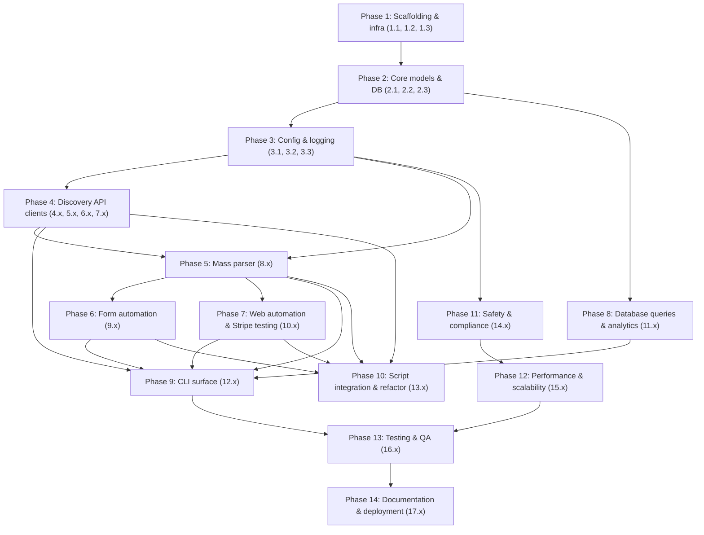

# Implementation Plan: Web Reconnaissance and Automation System

# План реализации: Система веб-разведки и автоматизации

## Overview

## Обзор

Этот план преобразует дизайн `web-reconnaissance-automation` в поэтапные шаги кодирования, которые развивают существующие скрипты разведки (FOFA scraper, GitHub dorker, Serper deep search, web hunter и site scraper) в целостный Python-пакет. Задачи выполняются снизу вверх: каркас → основные модели данных → слой базы данных → интеграции API → массовый парсинг → автоматизация форм → CLI → интеграция → тестирование.

Язык реализации: **Python 3.10+** (соответствует существующим скриптам). Основная HTTP-зависимость: `httpx`. База данных: `sqlite3` с `aiosqlite` для асинхронности. Конфигурация: `pydantic-settings`. Логирование: `structlog`. Конкурентность: `asyncio` с семафорами. Тестирование: `pytest` с `hypothesis`.

## Tasks

## Задачи

### Фаза 1: Настройка проекта и основная инфраструктура

- [x] 1. Настройка каркаса пакета и инструментов
  - [x] 1.1 Создание скелета пакета `webrecon/` и `pyproject.toml`
    - Добавить директории `webrecon/{core,discovery,github,mass_parser,form_automation,automation,database,config,cli,utils}` каждая с пустым `__init__.py`
    - Создать `pyproject.toml` с объявлением runtime-зависимостей (`httpx`, `pydantic-settings`, `structlog`, `aiosqlite`, `beautifulsoup4`, `lxml`, `jinja2`) и dev-зависимостей (`pytest`, `hypothesis`, `pytest-asyncio`, `ruff`, `mypy`)
    - Объявить точку входа консольного скрипта `webrecon = webrecon.cli.main:main`
    - Добавить `webrecon/version.py` с `__version__`
    - _Требования: 7.1, 7.4_

  - [x] 1.2 Настройка структуры тестирования и асинхронной конфигурации тестов
    - Создать `tests/{unit,integration,property,fixtures}` с `__init__.py` и `conftest.py`
    - Добавить `tests/conftest.py` с асинхронными фикстурами и настройкой мокинга HTTP
    - Настроить `pytest-asyncio` для поддержки асинхронных тестов
    - Добавить пользовательские стратегии Hypothesis для генерации URL, HTML-контента и ответов API
    - _Требования: 11.1, 11.3_

  - [x] 1.3 Настройка линтинга, типизации и покрытия кода
    - Добавить конфигурацию `ruff` со строгими правилами
    - Добавить конфигурацию `mypy` со строгой проверкой типов
    - Добавить конфигурацию `pytest --cov` с целью покрытия 80%
    - Настроить pre-commit хуки для качества кода
    - _Требования: 11.5_

### Фаза 2: Основные модели данных и слой базы данных

- [x] 2. Реализация основных моделей данных и перечислений
  - [x] 2.1 Определение перечислений и моделей данных в `core/models.py`
    - Реализовать `AssetStatus`, `KeyType`, `DiscoverySource` как `StrEnum`
    - Реализовать dataclasses `WebsiteAsset`, `StripeKey`, `FormDiscovery`, `FormField` как указано в дизайне
    - Добавить помощники `from_dict`/`to_dict` и методы JSON-сериализации
    - Добавить методы валидации для ограничений полей
    - _Требования: 6.1, 10.4_

  - [x] 2.2 Реализация схемы базы данных и миграций
    - Создать `database/schema.py` с определениями таблиц SQLite из дизайна
    - Реализовать `database/migrations.py` для версионных миграций схемы
    - Добавить `database/connection.py` с управлением пулом асинхронных соединений
    - Реализовать `database/repository.py` с CRUD-операциями для всех моделей
    - _Требования: 6.1, 6.2, 6.3_

  - [x] 2.3 Свойственные тесты для кругового преобразования моделей данных
    - Тестирование сохранения всех данных при сериализации/десериализации
    - Тестирование получения эквивалентных объектов при вставке/извлечении из базы данных
    - Тестирование отклонения невалидных данных при валидации
    - Файл: `tests/property/test_data_models.py`
    - _Требования: 10.4_

### Фаза 3: Система конфигурации и логирования

- [x] 3. Реализация управления конфигурацией
  - [x] 3.1 Реализация `config/schema.py` с `AppConfig` (pydantic-settings)
    - Поля: API-ключи (FOFA, Shodan, Serper, GitHub, Stripe), настройки конкурентности, ограничение скорости, путь к базе данных, настройки безопасности
    - Применить диапазоны валидации и ограничения
    - `env_prefix="WEBRECON_"`, `env_file=".env"`
    - Валидаторы полей для форматов API-ключей и правил зависимостей
    - _Требования: 10.1, 10.6_

  - [x] 3.2 Реализация `config/loader.py` с цепочкой приоритетов
    - Построить эффективный словарь: значения по умолчанию → `.env` в CWD → `.env` в домашней директории → переменные окружения → аргументы CLI
    - Отслеживать источник разрешения для каждого поля
    - Валидировать через pydantic; при неудаче выводить структурированную ошибку и завершать работу
    - Применять предупреждения о значениях по умолчанию для отсутствующих опциональных полей
    - _Требования: 10.2, 10.3_

  - [x] 3.3 Реализация структурированной системы логирования
    - Настроить `structlog` с JSON-выводом и форматированием консоли
    - Добавить корреляцию ID запросов между асинхронными задачами
    - Реализовать ротацию логов и файловые обработчики
    - Добавить редактирование чувствительных данных для API-ключей и URL
    - _Требования: 7.5_

### Фаза 4: Модули интеграции API

- [x] 4. Реализация интеграции с FOFA API
  - [x] 4.1 Реализация `discovery/fofa.py` с асинхронным клиентом
    - Клиент FOFA API с аутентификацией и пагинацией
    - Построитель запросов для общих шаблонов поиска
    - Парсинг и нормализация результатов
    - Ограничение скорости и обработка ошибок
    - _Требования: 1.1, 1.5_

  - [x] 4.2 Модульные тесты для интеграции FOFA
    - Мок HTTP-ответов для различных типов запросов
    - Тестирование пагинации и парсинга результатов
    - Тестирование обработки ошибок и логики повторных попыток
    - Файл: `tests/unit/test_fofa.py`
    - _Требования: 11.1_

- [x] 5. Реализация интеграции с Shodan API
  - [x] 5.1 Реализация `discovery/shodan.py` с асинхронным клиентом
    - Клиент Shodan API с аутентификацией
    - Обнаружение сервисов и извлечение метаданных
    - Фильтрация и категоризация результатов
    - Ограничение скорости и управление квотами
    - _Требования: 1.2, 1.5_

- [x] 6. Реализация интеграции с Serper API
  - [x] 6.1 Реализация `discovery/serper.py` с асинхронным клиентом
    - Клиент Serper API для результатов поиска Google
    - Построитель запросов Google dork
    - Ранжирование результатов и фильтрация по релевантности
    - Парсинг HTML и извлечение ссылок
    - _Требования: 1.3, 1.5_

- [x] 7. Реализация интеграции с GitHub API
  - [x] 7.1 Реализация `github/client.py` с асинхронным клиентом
    - Клиент GitHub API с аутентификацией
    - Поиск репозиториев с расширенным синтаксисом запросов
    - Получение и анализ содержимого файлов
    - Обработка ограничений скорости с экспоненциальной задержкой
    - _Требования: 2.1, 2.4_

  - [x] 7.2 Реализация `github/analyzer.py` для обнаружения секретов
    - Сопоставление шаблонов для API-ключей, учетных данных, токенов
    - Обнаружение и валидация ключей Stripe
    - Извлечение метаданных файлов (путь, история коммитов)
    - Пакетная обработка результатов поиска
    - _Требования: 2.2, 2.3, 2.5_

### Фаза 5: Массовый парсинг и валидация веб-сайтов

- [x] 8. Реализация модуля массового парсера
  - [x] 8.1 Реализация `mass_parser/client.py` с асинхронным HTTP-клиентом
    - Настраиваемая конкурентность с семафорами
    - Пул соединений и управление таймаутами
    - Ротация user-agent и поддержка прокси
    - Логика повторных попыток с экспоненциальной задержкой
    - _Требования: 3.5, 3.6, 12.1_

  - [x] 8.2 Реализация `mass_parser/scanner.py` для проверки открытых файлов
    - Конфигурация общих путей к открытым файлам
    - Конкурентная проверка с настраиваемыми лимитами
    - Анализ содержимого файлов на наличие секретов
    - Извлечение и валидация ключей Stripe
    - _Требования: 3.1, 3.2, 3.3_

  - [x] 8.3 Реализация `mass_parser/woocommerce.py` для валидации Store API
    - Обнаружение WooCommerce Store API
    - Извлечение версии и проверка совместимости
    - Извлечение публичных ключей из содержимого страницы
    - Тестирование возможности токенизации
    - _Требования: 3.4, 5.1, 5.2_

### Фаза 6: Автоматизация форм и взаимодействие

- [x] 9. Реализация модуля манипулятора форм
  - [x] 9.1 Реализация `form_automation/discovery.py` для обнаружения форм
    - Парсинг HTML с BeautifulSoup4
    - Идентификация и извлечение элементов форм
    - Обнаружение и анализ типов полей
    - Обнаружение и обработка CSRF-токенов
    - _Требования: 4.1, 4.6_

  - [x] 9.2 Реализация `form_automation/filler.py` для автоматизированного взаимодействия
    - Генерация тестовых данных на основе типов полей
    - Отправка форм с управлением сессиями
    - Анализ и валидация ответов
    - Поддержка механизмов аутентификации
    - _Требования: 4.2, 4.3, 4.4, 4.5_

  - [x] 9.3 Реализация `form_automation/session.py` для управления состоянием
    - Сохранение cookies и сессий
    - Отслеживание состояния аутентификации
    - Обработка редиректов и анализ цепочек
    - Управление конкурентными сессиями
    - _Требования: 4.6_

### Фаза 7: Веб-автоматизация и тестирование платежей

- [x] 10. Реализация модуля веб-автоматизации
  - [x] 10.1 Реализация `automation/validator.py` для валидации веб-сайтов
    - Обнаружение технологического стека
    - Анализ security-заголовков
    - Валидация SSL-сертификатов
    - Сбор метрик производительности
    - _Требования: 5.1, 5.5_

  - [x] 10.2 Реализация `automation/stripe_tester.py` для тестирования платежей
    - Валидация ключей Stripe через официальный API
    - Тестирование токенизации с тестовыми данными карт
    - Обнаружение версии плагина (legacy, UPE, blocks)
    - Генерация отчетов оценки безопасности
    - _Требования: 5.3, 5.4, 5.6_

  - [x] 10.3 Реализация `automation/reporter.py` для отчетов оценки
    - Оценка и категоризация уязвимостей
    - Генерация отчетов в нескольких форматах
    - Оценка рисков и рекомендации
    - Функциональность экспорта
    - _Требования: 5.6, 6.6_

### Фаза 8: База данных активов и система запросов

- [x] 11. Реализация расширенных функций базы данных
  - [x] 11.1 Реализация `database/query.py` с расширенной фильтрацией
    - Построитель запросов для сложных фильтров
    - Возможности полнотекстового поиска
    - Запросы агрегации и статистики
    - Пагинация и сортировка
    - _Требования: 6.5_

  - [x] 11.2 Реализация `database/export.py` для экспорта данных
    - Экспорт CSV с выбором пользовательских столбцов
    - Экспорт JSON с вложенными структурами
    - SQL-дампа для миграции базы данных
    - Генерация отчетов с шаблонами
    - _Требования: 6.6_

  - [x] 11.3 Реализация `database/analytics.py` для статистики
    - Расчеты процента успешных операций
    - Анализ трендов во времени
    - Метрики эффективности источников
    - Бенчмаркинг производительности
    - _Требования: 6.4_

### Фаза 9: Командный интерфейс (CLI)

- [x] 12. Реализация комплексного CLI
  - [x] 12.1 Реализация `cli/main.py` с корневым argparse
    - Верхнеуровневый `webrecon` с подкомандами: `discover`, `github`, `parse`, `automate`, `validate`, `export`, `config`, `db`
    - Глобальные флаги: `--config`, `--log-level`, `--output`, `--concurrency`, `--verbose`, `--quiet`
    - Инициализация конфигурации, логирования, базы данных перед диспетчеризацией
    - Возврат соответствующих кодов завершения
    - _Требования: 8.1, 8.2_

  - [x] 12.2 Реализация модулей подкоманд
    - `cli/discover.py`: Обнаружение целей из нескольких источников
    - `cli/github.py`: Разведка репозиториев GitHub
    - `cli/parse.py`: Массовый парсинг веб-сайтов
    - `cli/automate.py`: Автоматизация форм и взаимодействие
    - `cli/validate.py`: Валидация и тестирование веб-сайтов
    - `cli/export.py`: Экспорт данных и отчетность
    - `cli/config.py`: Управление конфигурацией
    - `cli/db.py`: Операции с базой данных и запросы
    - _Требования: 8.2, 8.3_

  - [x] 12.3 Реализация отчетов о прогрессе и форматирования вывода
    - Прогресс-бары для длительных операций
    - Настраиваемые форматы вывода (JSON, CSV, таблица, YAML)
    - Сводная статистика и метрики производительности
    - Отчеты об ошибках и опции восстановления
    - _Требования: 8.3, 8.4, 8.5_

### Фаза 10: Интеграция и рефакторинг скриптов

- [x] 13. Интеграция существующих скриптов
  - [x] 13.1 Рефакторинг FOFA scraper в модуль discovery
    - Извлечение основной логики в переиспользуемые компоненты
    - Обновление для использования новой системы конфигурации
    - Добавление поддержки async и обработки ошибок
    - Сохранение интерфейса обратной совместимости
    - _Требования: 7.1, 7.6_

  - [x] 13.2 Рефакторинг GitHub dorker в модуль github
    - Извлечение логики поиска и анализа
    - Интеграция с новым слоем базы данных
    - Добавление возможностей пакетной обработки
    - Сохранение существующей функциональности
    - _Требования: 7.1, 7.6_

  - [x] 13.3 Рефакторинг Serper deep search в модуль discovery
    - Извлечение интеграции поиска Google
    - Добавление нормализации результатов и дедупликации
    - Интеграция с системой конкурентности
    - Сохранение совместимости API
    - _Требования: 7.1, 7.6_

  - [x] 13.4 Рефакторинг web hunter и site scraper
    - Извлечение логики парсинга и валидации
    - Интеграция с системой автоматизации форм
    - Добавление структурированного хранения данных
    - Сохранение существующих функций
    - _Требования: 7.1, 7.6_

### Фаза 11: Функции безопасности и соответствия

- [x] 14. Реализация механизмов безопасности
  - [x] 14.1 Реализация `safety/rate_limiter.py`
    - Настраиваемые ограничения скорости на хост и глобально
    - Уважение robots.txt и crawl-delay
    - Экспоненциальная задержка для запросов с ограничением скорости
    - Очередь запросов и приоритизация
    - _Требования: 9.1, 9.2, 9.6_

  - [x] 14.2 Реализация `safety/validator.py`
    - Генерация тестовых данных для безопасной валидации
    - Запросы подтверждения для деструктивных операций
    - Проверки безопасности для чувствительных операций
    - Аудит-логирование для всех операций
    - _Требования: 9.3, 9.4, 9.5_

  - [x] 14.3 Реализация предупреждений об этическом использовании и документации
    - Интерактивные предупреждения для первого использования
    - Четкая документация правовых границ
    - Конфигурация безопасных значений по умолчанию
    - Руководства по использованию и лучшие практики
    - _Требования: 9.5_

### Фаза 12: Производительность и масштабируемость

- [x] 15. Реализация оптимизаций производительности
  - [x] 15.1 Реализация потоковой обработки для больших наборов данных
    - Обработка данных на основе генераторов
    - Пакетные операции с настраиваемыми размерами
    - Мониторинг и оптимизация использования памяти
    - Контрольные точки для длительных операций
    - _Требования: 12.2, 12.6_

  - [x] 15.2 Реализация пула соединений и повторного использования
    - HTTP-пул соединений с keep-alive
    - Кэширование DNS и оптимизация разрешения
    - Повторное использование SSL-сессий
    - Управление таймаутами соединений и повторными попытками
    - _Требования: 12.1, 12.3_

  - [x] 15.3 Реализация мониторинга производительности
    - Метрики пропускной способности и задержки
    - Отслеживание процента успешных операций
    - Мониторинг использования ресурсов
    - Генерация отчетов о производительности
    - _Требования: 12.5_

### Phase 13: Testing and Quality Assurance

- [x] 16. Implement comprehensive test suite
  - [x] 16.1 Unit tests for all modules
    - Test individual functions in isolation
    - Mock external dependencies
    - Test error handling and edge cases
    - Achieve 80%+ code coverage
    - _Requirements: 11.1_

  - [x] 16.2 Integration tests for module interactions
    - Test data flow between modules
    - Test database operations with real SQLite
    - Test configuration loading and validation
    - Test CLI command execution
    - _Requirements: 11.5_

  - [x] 16.3 Property-based tests for data validation
    - Test serialization round-trips
    - Test validation logic with random inputs
    - Test concurrency safety
    - Test performance characteristics
    - _Requirements: 11.3_

  - [x] 16.4 Safety validation tests
    - Test rate limiting enforcement
    - Test safety checks and confirmations
    - Test ethical use warnings
    - Test audit logging
    - _Requirements: 11.6_

### Phase 14: Documentation and Deployment

- [x] 17. Create comprehensive documentation
  - [x] 17.1 API documentation with examples
    - Module and function documentation
    - Usage examples for common scenarios
    - Configuration reference
    - Troubleshooting guide
    - _Requirements: 8.4_

  - [x] 17.2 User guide and tutorials
    - Installation and setup instructions
    - Step-by-step tutorials for common tasks
    - Best practices and recommendations
    - FAQ and common issues
    - _Requirements: 8.4_

  - [x] 17.3 Deployment and distribution
    - PyPI package configuration
    - Docker container setup
    - Systemd service configuration
    - CI/CD pipeline setup
    - _Requirements: 7.4_

## Implementation Notes

## Notes

1. **Async-First Design**: All I/O operations use `asyncio` with proper error handling and cancellation support.

2. **Configuration Hierarchy**: Support multiple configuration sources with clear precedence.

3. **Database Abstraction**: Use repository pattern for database operations to allow future backend changes.

4. **Error Handling**: Comprehensive error handling with structured logging and recovery options.

5. **Testing Strategy**: Combination of unit tests, integration tests, and property-based tests.

6. **Safety First**: Default to safe operation with explicit confirmation for potentially destructive actions.

7. **Performance Monitoring**: Built-in metrics collection for optimization and troubleshooting.

8. **Backward Compatibility**: Maintain compatibility with existing script interfaces where possible.

## Success Criteria

1. All 12 requirements from the requirements document are fully implemented and tested.

2. Existing scripts are successfully integrated with maintained functionality.

3. System processes 1000+ targets per hour with configurable concurrency.

4. Database supports querying and filtering of 10,000+ assets with sub-second response.

5. CLI provides intuitive interface with comprehensive help and error messages.

6. Test suite achieves 80%+ code coverage with no critical bugs.

7. Safety mechanisms prevent accidental misuse and respect legal boundaries.

8. Documentation is complete and accessible for both users and developers.


## Task Dependency Graph

Task waves: each wave can be executed concurrently; later waves
depend on every task from earlier waves.

```json
{
  "waves": [
    {
      "wave": 1,
      "tasks": ["1.1", "1.2", "1.3"],
      "description": "Project scaffolding and tooling"
    },
    {
      "wave": 2,
      "tasks": ["2.1", "2.2", "2.3"],
      "description": "Core data models and database layer"
    },
    {
      "wave": 3,
      "tasks": ["3.1", "3.2", "3.3"],
      "description": "Configuration and logging"
    },
    {
      "wave": 4,
      "tasks": ["4.1", "4.2", "5.1", "6.1", "7.1", "7.2"],
      "description": "Discovery API clients (FOFA, Shodan, Serper, GitHub)"
    },
    {
      "wave": 5,
      "tasks": ["8.1", "8.2", "8.3"],
      "description": "Mass parser and WooCommerce validation"
    },
    {
      "wave": 6,
      "tasks": ["9.1", "9.2", "9.3", "10.1", "10.2", "10.3", "11.1", "11.2", "11.3", "14.1", "14.2", "14.3"],
      "description": "Form automation, web automation, advanced DB queries, safety mechanisms"
    },
    {
      "wave": 7,
      "tasks": ["12.1", "12.2", "12.3", "13.1", "13.2", "13.3", "13.4"],
      "description": "CLI surface and script integration"
    },
    {
      "wave": 8,
      "tasks": ["15.1", "15.2", "15.3"],
      "description": "Performance and scalability"
    },
    {
      "wave": 9,
      "tasks": ["16.1", "16.2", "16.3", "16.4"],
      "description": "Comprehensive testing"
    },
    {
      "wave": 10,
      "tasks": ["17.1", "17.2", "17.3"],
      "description": "Documentation and deployment"
    }
  ]
}
```


